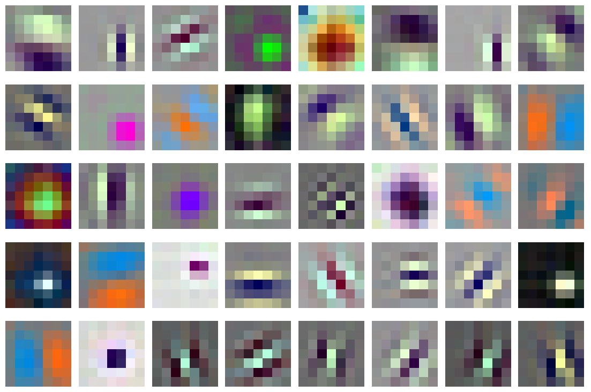
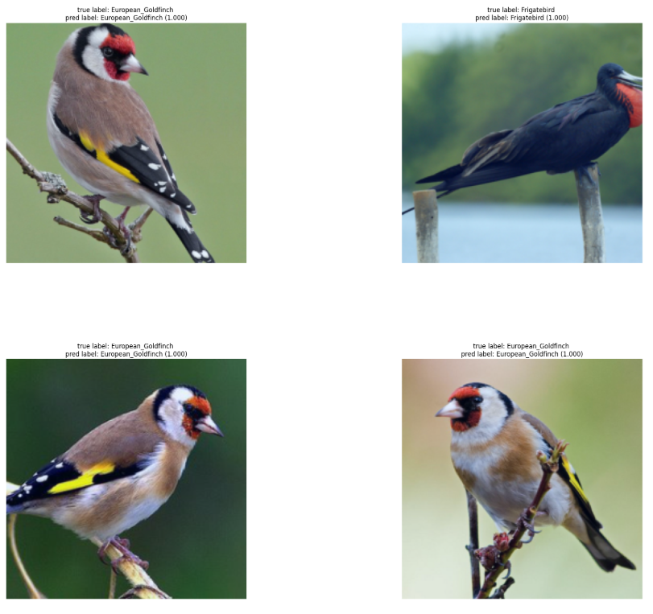
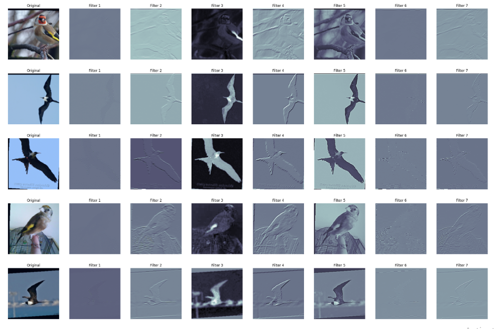
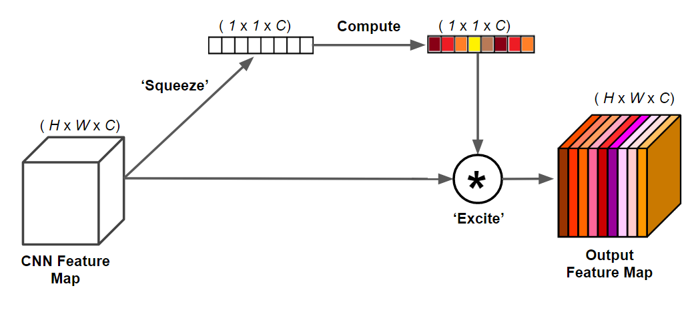

# Image Classification Using ResNet and Channel-Wise (Squeeze and Excitation) Attention

This repository contains an implementation of an image classification model combining the ResNet architecture with channel-wise attention mechanisms, such as Squeeze-and-Excitation (SE) blocks. By integrating attention, this model enhances feature representations, allowing for improved classification performance on complex image datasets. A conveniant dataset is provided for a quick test.


<div align="center">


</div>

<div align="center">
 
</div>


## Features

- **ResNet Backbone**: Uses a customizable ResNet architecture with bottleneck layers for powerful feature extraction.

<div align="center">
 
</div>

- **Channel-Wise Attention**: Adds [squeeze and excitation](https://arxiv.org/abs/1709.01507) blocks for channel attention, focusing on important features to boost model accuracy.

<div align="center">

</div>


- **Modular and Extendable Code**: Easily adapts to various ResNet configurations (e.g., ResNet-50, ResNet-101).
- **Training and Evaluation Scripts**: Provides scripts for training, validation, and testing, making it straightforward to use on new datasets.

## Requirements

- Python 3.9
- PyTorch
- NumPy
- Matplotlib
- scikit-learn

```bash
pip install torch numpy matplotlib scikit-learn
```


## Usage

To train and evaluate the image classification model:

1. **Clone the Repository**: Clone this repository and install the required libraries.
    
    ```bash
    git clone https://github.com/MjdMahasneh/Image_Classification_Using_ResNet_and_Channel_Wise_Attention.git
    cd Image-Classification-ResNet-SE
    ```
2. **Follow the steps in the notebook**: Modify configurations as needed (e.g., dataset paths, model hyperparameters).


## Applications

This model is suitable for various image classification tasks, including object recognition, pattern detection, and visual scene understanding.

---

**Note**: Feel free to experiment with different configurations and attention mechanisms for optimal results on your dataset.
